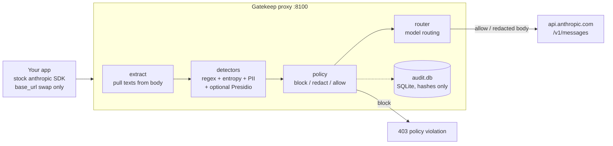

# Architecture

Gatekeep is a transparent reverse proxy that sits between your application and the
Anthropic Messages API. Your app thinks it's talking to `api.anthropic.com`; it's
actually talking to Gatekeep, which inspects and (if needed) modifies each request
before forwarding it upstream.

## Request lifecycle

Every `POST /v1/messages` runs through the same pipeline:

1. **Extract** (`extract.py`) — pull every scannable text out of the request body: the
   `system` prompt and every `messages[].content`, whether it's a plain string or
   Anthropic's structured content-block format. Non-text blocks are never scanned.
2. **Detect** (`detectors/`) — run each text through the detectors (see below). Only the
   first 200,000 characters of any single text are scanned, as a guard against
   pathological input.
3. **Decide** (`policy.py`) — map every finding to an action via `policies.yaml`. When a
   request produces multiple findings, the most severe action wins: **block > redact > allow**.
4. **Act:**
   - **block** → return `403` immediately with an Anthropic-shaped error body. The request
     never reaches the model.
   - **redact** → replace the sensitive spans with `[REDACTED:CATEGORY]` and forward the
     sanitized body.
   - **allow** → forward unchanged.
5. **Route** (`router.py`) — optionally swap the target model based on the decision (e.g.
   send already-sanitized traffic to a cheaper model).
6. **Forward** (`forwarder.py`) — send the (possibly modified) request to
   `api.anthropic.com`, copying the client's headers minus `host`/`content-length`. The
   proxy holds **no API key of its own** — the client's `x-api-key` passes through untouched.
7. **Audit** (`audit.py`) — write one row describing the decision. See "The never-log rule."

## Detection layers

Detection is hybrid by design — explainable rules first, ML only where rules can't reach:

| Layer | Catches | How |
|---|---|---|
| **Named regexes** (`secrets.py`) | AWS keys, GitHub/Slack tokens, PEM private-key headers, JWTs | One named pattern per credential format |
| **Shannon entropy** (`secrets.py`) | Opaque high-randomness secrets no pattern knows | Flags mixed-charset tokens above an entropy threshold |
| **PII validators** (`pii.py`) | SSN, credit card, email, US phone | Regex + real validation (SSA issuance rules for SSNs, Luhn checksum for cards) to cut false positives |
| **Presidio NER** (`presidio_layer.py`, optional) | Names, locations | Microsoft Presidio; off by default, lazy-imported only when enabled |

Every threshold and rule lives in `policies.yaml`, never in code — see
[configuration.md](configuration.md).

## The never-log rule

The audit database stores **only** metadata: timestamp, action, categories, detector
names, a SHA-256 hash of the prompt, the requested/routed model, upstream status, and
latency. The raw prompt and the matched secret/PII text are **never** written anywhere.
This is enforced structurally (the audit row has no field for raw text) and verified in
the test harness by byte-scanning the database file for a seeded secret after every run.

## Design boundaries (v1)

These are deliberate scope choices, not bugs — each keeps the core simple and auditable:

- **Inbound only.** Prompts are scanned; model responses are not.
- **No streaming.** `stream: true` returns a structured `400` (the input is still scanned
  and blocked first if dirty, and the rejection is audited).
- **Anthropic Messages API only.** Transparent passthrough, no OpenAI-format translation.
- **No built-in auth / multi-tenancy.** Put a real gateway in front for that (see
  [deployment.md](deployment.md)).
